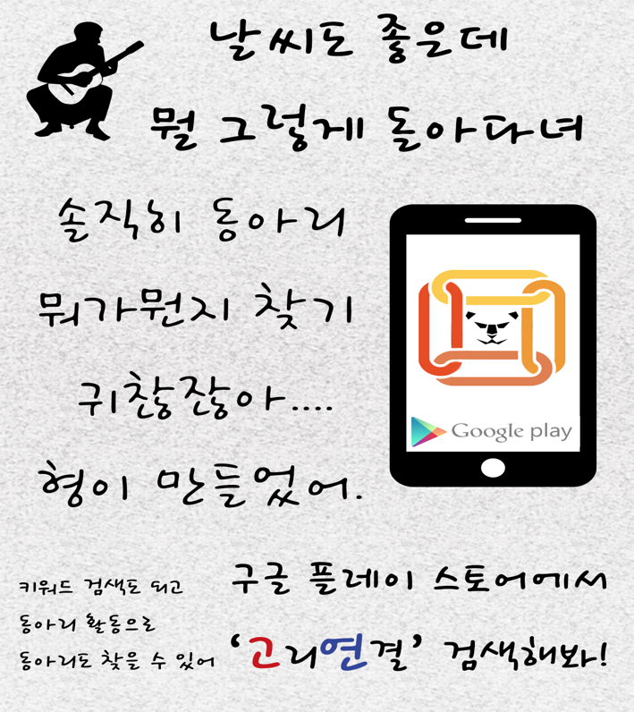
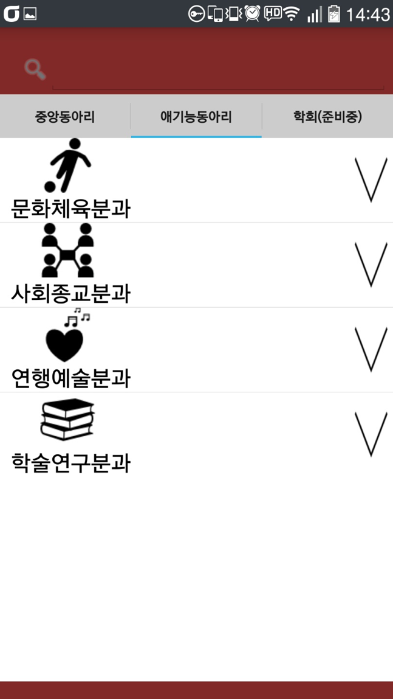
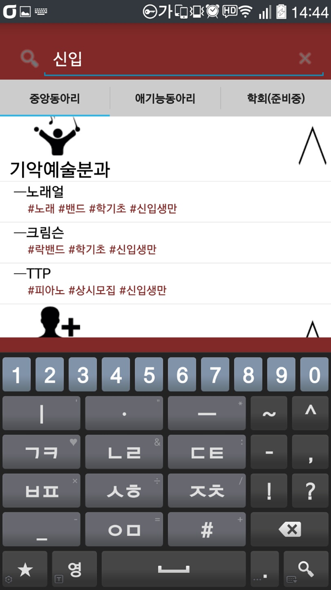

## Why
`교내 동아리 정보가 싸이월드를 통해 유지되는데 싸이월드는 이미 사용자가 매우적어 이용이 어렵고 현재 관리가 제대로 되고있지 않습니다. 이에따라 몇몇 동아리에서는 따로 홈페이지를 운영하거나 페이스북 페이지를 운영합니다. 결국 신입생이나 동아리들에 대한 정보를 얻으려는 학생이 정보의 산재로 인해 불편함과 어려움을 겪고있습니다.`

***따라서 이러한 문제를 해결하기위해 모바일 어플리케이션으로 동아리 정보들을 통합하여 관리하려고 합니다.***

## What
`안드로이드 기반 동아리 커뮤니티 어플리케이션 입니다.`
`동아리의 이름으로만 검색을하기에는 사전에 동아리에 대해서 알지못하면 찾기가 힘들므로 각 동아리별 해시태그 정보를 두어 '농구','음악' 같은 검색어로도 관련 동아리를 찾을 수 있습니다.`
`해당 동아리를 클릭하면 동아리 포스터를 확인할 수 있습니다.`

## How

